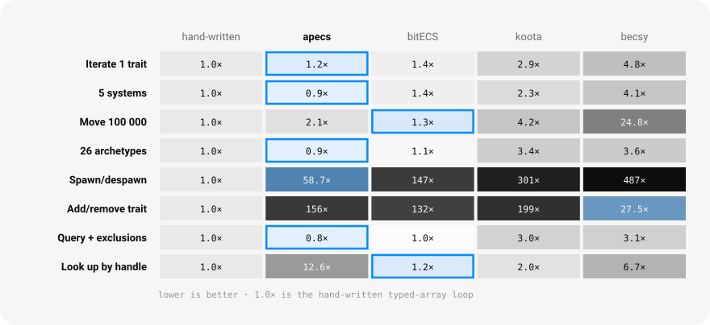
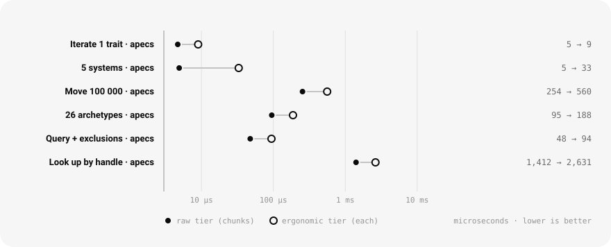
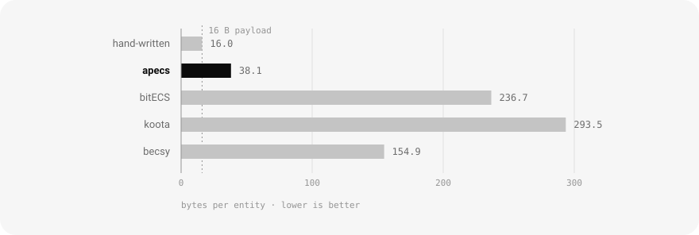

# apecs

A high-performance archetype ECS for TypeScript.

[](https://www.npmjs.com/package/apecs)
[](#license)
[](#requirements)

An **Entity Component System** stores game or simulation state as flat tables instead of object
graphs. Data of one kind lives in one contiguous array, and a "system" is a loop over that array.
apecs is a TypeScript implementation of that idea: entities are plain numbers, component data lives
in typed arrays, and iterating a query compiles down to a linear scan over those arrays with no
allocation per entity and no per-frame matching work.

It ships React and Solid bindings, a scheduler, relations, change detection, and sorted iteration —
each with a documented cost.

```bash
npm install apecs
```

Optional — install the agent skill, so Claude Code and compatible agents know the API and its
trade-offs:

```bash
npx skills add @diffusionstudio/apecs
```

---

## Contents

- [Quick start](#quick-start) · [Benchmarks](#benchmarks)
- [Traits](#traits) · [Entities](#entities) · [Reading and writing](#reading-and-writing)
- [Queries](#queries) · [Order](#order) · [Relations](#relations)
- [Change detection](#change-detection) · [Structural changes during iteration](#structural-changes-during-iteration)
- [The frame](#the-frame) · [React and Solid](#react-and-solid)
- [API reference](#api-reference) · [Requirements](#requirements) · [License](#license)

---

## Quick start

```ts
import { World, Trait, Schedule, f32 } from 'apecs';

// Traits are declared once, at module scope.
const Position = new Trait({ x: f32(0), y: f32(0) });
const Velocity = new Trait({ x: f32(0), y: f32(0) });
const IsEnemy = new Trait(); // no data — a tag
const Time = new Trait({ delta: 0 });

const world = new World();
world.add(Time); // no entity argument → the world's own singleton state

const player = world.spawn(Position({ x: 20, y: 10 }), Velocity);
const swarm = world.spawnMany(10_000, Position, Velocity, IsEnemy);

function movement(world: World) {
  const dt = world.get(Time.delta);
  world.query(Position, Velocity).each((p, v) => {
    p.x += v.x * dt;
    p.y += v.y * dt;
  });
}

const sim = new Schedule().add('movement', movement);

function frame(dt: number) {
  world.set(Time, { delta: dt });
  sim.run(world);
}
```

Three things are worth knowing before anything else.

- **Traits are global; worlds are isolated.** A trait declared at module scope works in any number
  of worlds with independent storage. A world only pays for the traits it actually uses, so
  declaring a thousand traits and using twelve costs the same as declaring twelve.
- **Entities are numbers, not objects.** An entity handle packs a world id, a generation counter and
  an id into a single 52-bit number. A stale handle fails a liveness check instead of silently
  pointing at a recycled entity.
- **Queries are cached.** `world.query(Position, Velocity)` inside a system, every frame, is the
  intended usage: it is a hash lookup returning the same object, and the set of matching data is
  maintained incrementally rather than recomputed.

---

## Benchmarks

Measured on an Apple M1, Node v20.19.0, against bitECS 0.4.0, koota 0.6.6 and becsy 0.15.5, with a
hand-written typed-array loop as the floor. One process per library per benchmark, minimum of three
full runs, every library at its own fastest correct idiom, and an entity-count census that aborts
the run if the libraries are not doing the same work. Full method and every number:
[benchmark report](reports/2026-09-05-apecs-benchmark.html) ·
[table](bench/compare/REPORT.md).

### Against the field

<picture>
  <source media="(prefers-color-scheme: dark)" srcset="assets/bench-baseline-dark.svg">
  
</picture>

Every cell is a multiple of the hand-written floor; the outlined cell is the fastest library in that
row. Column-shaped work — iteration, query matching — is where an archetype layout wins. Work that
touches one entity at a time is where it loses: reaching an entity by handle costs three dependent
lookups against a flat array's one.

### What the escape hatch buys

<picture>
  <source media="(prefers-color-scheme: dark)" srcset="assets/bench-tiers-dark.svg">
  
</picture>

`each` hands you a small object per trait with `.x` / `.y` properties; `chunks` hands you the typed
arrays themselves. The ergonomic tier costs about 2× the raw one on everything but the smallest
benchmark, where per-call overhead dominates a 5 µs frame. That is the number to weigh when deciding
whether a loop needs to drop down.

### Bytes per entity

<picture>
  <source media="(prefers-color-scheme: dark)" srcset="assets/bench-bytes-dark.svg">
  
</picture>

A world of entities carrying `Position` + `Velocity` — two `f32` fields each, so 16 bytes is the
payload itself. Everything above that is ids, masks, archetype bookkeeping and query caches.
At a million entities: 38 MB, against 155 MB for the next-lightest library measured.

### Known limits

Two, stated plainly.

- **Access by handle** (`world.get(e, …)`, accessors) is about 13× a flat typed array indexed by
  entity id. If a workload is dominated by random access rather than iteration, a sparse-set ECS
  will beat apecs on it.
- **`each` past four traits.** JavaScript engines specialise a call site for up to four object
  shapes. A program that uses five or more distinct traits through `each` pushes that site past the
  limit, and per-entity cost goes from ~2 ns to ~38 ns. `chunks` is unaffected — flat at ~1.2 ns
  through eight traits — so this is a reason to use `chunks` in the systems that matter, not a
  reason to avoid `each`.

---

## Traits

A trait is a named, typed piece of data. Declare it once; the argument carries both the shape and
the defaults.

```ts
import { Trait, f32, u16 } from 'apecs';

const Position = new Trait({ x: f32(0), y: f32(0) }); // struct — one typed array per field
const Health = new Trait({ current: 100, max: 100 }); // bare numbers → Float64Array
const IsActive = new Trait(); // tag — no storage at all
const Mesh = new Trait(() => new THREE.Mesh()); // factory → one boxed column
```

Nested objects are flattened, so `{ pos: { x: 0 } }` becomes the column `pos.x`. Field order is the
column order and is stable.

| Declaration         | Storage                                    | Notes                         |
| ------------------- | ------------------------------------------ | ----------------------------- |
| `0`                 | `Float64Array`                             | the default for numbers       |
| `f32(0)`, `f64(0)`  | `Float32Array`, `Float64Array`             |                               |
| `i8/i16/i32(0)`     | `Int8Array`, `Int16Array`, `Int32Array`    |                               |
| `u8/u16/u32(0)`     | `Uint8Array`, `Uint16Array`, `Uint32Array` |                               |
| `false`, `bool(v)`  | `Uint8Array`                               | read and written as `boolean` |
| `''`, `str(v)`      | `Array<string>`                            | boxed                         |
| `eid(0)`            | `Float64Array`                             | an entity handle — see below  |
| a factory `() => T` | `Array<T>`                                 | one reference per entity      |

The markers are typed as their underlying primitive, so `Position.x` is a `number` to TypeScript and
schemas read like plain objects.

**Fields are values.** A trait exposes its fields as properties, and a field is accepted anywhere a
single value is wanted:

```ts
world.get(e, Position.x); // number, no allocation
world.set(e, Position.x, 20);
world.query(Position).sortBy(Position.x, 'asc');
```

**Traits are callable.** Calling one pairs it with an initial value, for `spawn` and `add`:

```ts
world.spawn(Position({ x: 20 }), Velocity, IsActive); // partial init; the rest take defaults
world.spawn(Mesh(existingMesh)); // adopt a reference instead of calling the factory
```

**Entity references.** A field declared `eid(0)` holds an entity handle, and apecs knows it does: on
despawn, every stored reference to that entity is patched to `0`. A handle stored in a bare `0`
field is not patched and will simply fail its liveness check when read.

---

## Entities

```ts
const e = world.spawn(Position({ x: 20 }), Velocity, IsActive);
world.isAlive(e); // generation-checked
world.despawn(e); // immediate

world.add(e, Position({ x: 1 }), IsActive);
world.remove(e, Velocity);
world.has(e, Position);
```

Adding or removing a trait moves the entity's row to the archetype — the storage table — for its new
trait set. That is a couple of map lookups plus a row copy, not a rehash of the world.

**Bulk operations do one transition for the whole set** rather than one per entity, which is a large
difference on spawn-heavy work:

```ts
const swarm = world.spawnMany(10_000, Position, Velocity); // Float64Array of handles
world.addMany(swarm, IsActive);
world.removeMany(swarm, Velocity);
world.despawnMany(swarm);
world.despawnMany(world.query(Dead)); // a query result is a valid batch
```

**The world is an entity too.** Id 1 in every world is the world entity, and world-level state —
time, score, paused, the current selection — is an ordinary trait on it. Omitting the entity
argument targets it:

```ts
world.add(Time);
world.set(Time, { delta: 0.016 });
world.get(Time.delta); // number
world.remove(Time);
world.entity; // the handle, if you want it
```

`World` is a plain class, and subclassing is the intended way to extend it:

```ts
class Game extends World {
  readonly rng = new Rng(1234);
  constructor() {
    super({ pageSize: 8192 });
    this.add(Time);
  }
}
```

`world.clear()` despawns everything and keeps the world usable. `world.destroy()` releases it
entirely. `world.compact()` releases empty storage pages.

---

## Reading and writing

Four ways to reach data, fastest last. Choosing between them is the main decision apecs asks you to
make, so each row is honest about what it costs.

| Situation                                  | Use                          | Cost                                          |
| ------------------------------------------ | ---------------------------- | --------------------------------------------- |
| One entity, cold path (UI, editor, events) | `world.get(e, Position)`     | resolves per call; **allocates a copy**       |
| One entity, one value, cold path           | `world.get(e, Position.x)`   | resolves per call; no allocation              |
| One entity, hot path, arbitrary order      | `world.accessor(Position.x)` | resolves once; ~2 lookups per access          |
| Many entities, readable                    | `query.each((p, v) => …)`    | ~2× a raw loop, no allocation                 |
| Many entities, arithmetic, tens of 1000s   | `query.chunks()`             | ~1× a raw loop; no change tracking, no checks |

**`world.get` / `world.set`** resolve the subject on every call. `get` on a whole struct trait
returns a _copy_, so it allocates; pass an `out` object or read a single field to avoid that.

```ts
world.get(e, Position); // { x, y } — a copy
world.get(e, Position, out); // writes into `out`, returns it
world.set(e, Position, { x: 5 }); // partial write; fires 'change' observers
```

**Accessors** do the resolution once and keep it. They are the per-entity escape hatch: pathfinding,
physics callbacks, networking — anything addressing entities by handle in an order no query can
provide.

```ts
const px = world.accessor(Position.x); // memoised per world and field
px.get(e);
px.set(e, 5); // stamps the change tick and fires 'change', exactly like world.set
```

**`each`** is the default for iteration. Each data-bearing trait arrives as a reusable object with
`.x` / `.y` properties bound to the current row; the entity handle comes last.

```ts
world.query(Position, Velocity).each((p, v) => {
  p.x += v.x * dt;
});

world.query(Health, IsEnemy).each((hp, e) => {
  // IsEnemy is a tag — it contributes no argument
  if (hp.current <= 0) world.defer(() => world.despawn(e));
});
```

Only data-bearing terms contribute arguments. Tags, `Not` and `With` contribute none; `Optional`
contributes one that may be `null`. This is enforced by the types. A trait declared with a factory
yields the reference itself rather than a cursor. The objects `each` hands you are **borrowed** —
holding one past the callback is a development-build error.

**`chunks`** hands back the typed arrays. A chunk is one page of one matching table; every column in
it is index-aligned with `chunk.entities`.

```ts
for (const chunk of world.query(Position, Velocity).chunks()) {
  const { x, y } = chunk.get(Position);
  const { x: vx, y: vy } = chunk.get(Velocity);
  for (let i = 0, n = chunk.length; i < n; i++) {
    x[i] += vx[i] * dt;
    y[i] += vy[i] * dt;
  }
  chunk.markChanged(Position); // the setters were bypassed — say so explicitly
}
```

This tier does no change tracking and no liveness checks. That is the trade, and `markChanged` is
the part that is easy to forget: without it, `Changed()` filters miss the write and sorted views do
not re-sort. Development builds warn; production is silent. Views handed out by `chunk.get` are
valid only for the current step — do not keep them.

`markChanged` stamps change ticks; it fires no observers. The whole-page form above writes the
current tick across the page's tick array, which suits the usual chunk loop — one that writes every
row. When only some rows were written, pass the row so `Changed()` does not over-report:

```ts
chunk.markChanged(Position, i); // chunk-local row index, not an entity handle
```

The argument is a row rather than an entity because inside a chunk the row is what you already have;
an entity handle would have to be resolved back to a row through the entity index, which is exactly
the lookup this tier exists to avoid. `chunk.entity(i)` goes the other way when you need the handle.

---

## Queries

```ts
world.query(Position, Velocity); // has all of
world.query(Position, Not(Velocity)); // exclusion
world.query(Or(Velocity, Renderable)); // disjunction
world.query(Position, With(IsActive)); // require, but contribute no argument
world.query(Position, Optional(Velocity)); // match either way; the value may be null
world.query(Position, Changed(Position)); // written since this query last ran
world.query(Position, Added(Velocity));
world.query(Position, Removed(Velocity));
world.query(Position, Cascade(ChildOf)); // parents before children
```

Modifiers nest: `Or(Not(A), B)`. The term list is turned into a test over each storage table once,
when the table is created, so per-frame matching cost is zero.

The result is a small surface:

```ts
const q = world.query(Position, Velocity);

q.count; // number of matching entities
q.isEmpty;
q.first; // Entity | undefined — world.queryFirst(...) is sugar for this
for (const e of q) {
} // Tier 1: handles, read values through the world
q.each((p, v, e) => {});
q.chunks();
q.entities(); // Float64Array snapshot — safe to mutate the world while walking it
```

`world.createQuery(...)` is the same object under an explicit name, with a `dispose()` when you want
it out of the cache.

---

## Order

Query results are in storage order, which is not meaningful. Two ways to impose one, with different
trade-offs.

**`sortBy`** keeps the order in a side array. It supports handles and `each`, but not `chunks`.

```ts
for (const e of world.query(Sprite).sortBy(Layer.z, 'asc')) {
}
world.query(Sprite).sortBy((a, b) => /* … */ 0); // comparator form
```

**`orderBy`** instead rearranges the rows in storage so that row order _is_ key order. It supports
everything, `chunks` included, because there is nothing extra in the path — but it mutates rows that
every other query over that table sees, and the order is guaranteed per table, not globally. Use
`sortBy` when the order must be total.

```ts
for (const chunk of world.query(Sprite, Layer).orderBy(Layer.z).chunks()) {
}
```

Both are memoised on `(query, field, direction)`, so calling them every frame is a cache lookup.
Both track two levels of staleness: a changed sort key costs a linear re-sort, and a changed _set_
of matching entities costs a rebuild. A frame in which nothing moved costs one comparison per
matching table and nothing else.

When the key comes from something apecs cannot observe — a clock, a camera, a comparator closing
over mutable state — say so:

```ts
sorted.isDirty; // 'clean' | 'resort' | 'rebuild'
sorted.invalidate(); // force a re-sort on next access
sorted.rebuild(); // force a full rebuild
```

---

## Relations

A relation is a trait parameterised by a target entity.

```ts
import { Relation, Not, Cascade } from 'apecs';

const ChildOf = new Relation(undefined, { exclusive: true, onTargetDespawn: 'despawn' });
const Likes = new Relation({ amount: 0 });

const child = world.spawn(ChildOf(parent));
world.add(child, Likes(other, { amount: 5 }));

world.query(ChildOf(parent)); // children of one parent
world.query(ChildOf('*')); // anything with a parent
world.query(Position, Not(ChildOf('*'))); // roots
world.target(child, ChildOf); // Entity — 0 when absent
world.targets(e, Likes); // Entity[]
```

**Set `exclusive: true` whenever an entity has at most one target.** An exclusive relation stores the
target in a column with an index beside it: one storage table however many parents exist, and
re-targeting costs no table move at all. A non-exclusive relation instead gives every distinct
`(relation, target)` pair its own id — correct for `Likes` or `Owes`, and a problem at high fan-out.
Development builds warn when one grows past a threshold.

`onTargetDespawn` decides what happens to an entity whose target dies: `'remove'` (the default) drops
the relation, `'despawn'` takes the source with it, `'orphan'` keeps a dead target. Cascading
despawn uses an explicit work queue, so deep hierarchies do not overflow the stack, and cycles
terminate.

`Cascade(ChildOf)` orders a query by hierarchy depth, which turns transform propagation into one
linear pass:

```ts
world.query(Position, LocalTransform, Cascade(ChildOf)).each((pos, local) => {
  // every parent has already been visited
});
```

---

## Change detection

Two mechanisms, for two different questions.

**Push — observers.** Dispatched synchronously, inside the write. Every call returns its
unsubscribe.

```ts
const off = world.on('add', Position, (entity) => {});
world.on('remove', Mesh, (e) => world.get(e, Mesh).geometry.dispose()); // fires *before* the data goes
world.on('change', Position, (entity) => {});
world.on('add', ChildOf, (entity, target) => {}); // relations pass the target

world.on('enter', world.query(Position, IsActive), (entity) => {});
world.on('exit', world.query(Position, IsActive), (entity) => {});
```

`'enter'` / `'exit'` are usually what you actually want: "started matching this whole query", not
"one trait changed".

**Pull — change ticks.** The world holds a counter that `world.step()` advances. `Changed`, `Added`
and `Removed` compare against it, which is a scan of a `Uint32Array` with no calls in it. Each such
query remembers its own last-seen tick, so two systems watching the same trait do not consume each
other's events.

```ts
world.step();
world.query(Position, Changed(Position)).each((p) => {});
```

At scale, prefer pull. Tick storage is allocated only for traits that need it — a trait becomes
tracked on its first `'change'` subscription, first `Changed()` use, first `sortBy`, or with
`new Trait(schema, { track: true })` — so untracked traits pay nothing per write.

Ticks are written by `world.set`, by accessors, and by the objects `each` hands out. **Direct chunk
writes bypass them**; call `chunk.markChanged(trait, row?)` for a page or a row, or
`world.markChanged(e, trait)` for one entity by handle.

The two are not interchangeable. `world.markChanged` also fires `'change'` observers, exactly as
`world.set` does. `chunk.markChanged` only stamps ticks — nothing is dispatched, whether you mark a
row or the page. So a value written through `chunks` reaches `Changed()` filters and sorted views,
but never reaches a `'change'` observer or, therefore, a mounted React or Solid binding.

---

## Structural changes during iteration

The classic ECS footgun, stated explicitly. Tables are walked back to front, and removing a row
swaps the last row into its place.

| During iteration                                 | Safe?    |
| ------------------------------------------------ | -------- |
| Reading or writing values on **any** entity      | yes      |
| Adding/removing traits on **the current** entity | yes      |
| Despawning **the current** entity                | yes      |
| Touching **any other** entity                    | defer it |
| Spawning                                         | defer it |

```ts
world.query(Position).each((p, e) => {
  if (p.y < 0) world.defer(() => world.spawn(Splash({ at: e })));
});
// each() and chunks() flush the deferred queue at the outermost exit
```

`world.defer(fn)` queues a closure; `world.flush()` drains it in order. `query.entities()` returns a
snapshot copy and is always safe, when deferral is awkward. Development builds detect unsafe
mutation; production builds do not.

---

## The frame

Systems are plain functions of the world. Drive them by hand, or with a `Schedule` — a list of named
systems with `before` / `after` constraints, resolved once into a fixed order.

```ts
import { Schedule } from 'apecs';

const sim = new Schedule() // owns the clock: run() calls world.step()
  .add('movement', movement)
  .add('collide', collide, { after: 'movement' })
  .add('reap', reap, { after: ['collide', 'movement'] });

const render = new Schedule({ step: false }); // a second schedule must not step

function frame(dt: number) {
  world.set(Time, { delta: dt }); // per-frame values ride a trait, not a parameter
  sim.run(world);
  render.run(world);
}
```

Ordering disturbs registration order as little as the constraints allow, so a new constraint moves
only the systems it names. `schedule.order` exposes the resolved names. Development builds throw on
an unknown name, a self-constraint or a cycle; production drops the offending edge so every system
still runs exactly once.

**Exactly one schedule per frame may advance the clock.** The step count is observable: a removal is
visible for exactly one tick, so a second `step()` can expire a `Removed()` record before a
once-per-frame system sees it.

---

## React and Solid

`apecs/react` and `apecs/solid` are subpath entries of the same package, so there is no version
matrix. They project a mutable, frame-rate-decoupled world into a component tree under two rules:

- **Updates are gated on value, not on writes.** A simulation writing `Position.x = 4` sixty times
  between paints produces zero re-renders.
- **Updates coalesce to at most one per animation frame**, whatever rate the simulation runs at.

```tsx
import { WorldProvider, useField, useQuery, useSortedQueryFirst } from 'apecs/react';

<WorldProvider world={world}>…</WorldProvider>; // required; hooks throw without it

const hp = useField(player, Health.current); // a primitive, gated on Object.is
const score = useField(Score.value); // no entity → world trait
const enemies = useQuery(Position, IsEnemy); // readonly Entity[]
const nearest = useSortedQueryFirst([Position, IsEnemy], Distance.value);
```

Solid is the same set with `create*` names and a bare `on` for subscriptions, and everything returns
a getter:

```ts
import { createField, createQuery } from 'apecs/solid';

const hp = createField(player, Health.current);
const enemies = createQuery(Position, IsEnemy);
hp(); // call it
```

Two things to internalise:

1. **Systems iterate; components read single values.** Never call `each` or `chunks` in a render
   function.
2. **Anything that changes every frame does not belong in a re-render.** Use the imperative
   subscription (`useOn` / `on`) and write into a ref or a canvas — that is what it is for.

`useEntity` / `createEntity` spawn on mount and despawn on unmount. Under React StrictMode, effects
are double-invoked, so a mount burns one entity id.

---

## API reference

### `apecs`

```ts
// declaration
new Trait(schema?, options?)              // options: { track?: boolean }
new Relation(schema?, options?)           // options: { exclusive?, onTargetDespawn? }
f32 f64 i8 i16 i32 u8 u16 u32 bool str eid

// query terms
Not(term)  Or(...terms)  With(trait)  Optional(trait)
Added(trait)  Removed(trait)  Changed(trait)  Cascade(relation)
```

| World                         |                                               |
| ----------------------------- | --------------------------------------------- |
| `new World(options?)`         | `{ pageSize?, maxEntities? }`                 |
| `world.entity`                | the world entity's handle                     |
| `world.tick` / `world.step()` | the change-detection counter, and its advance |
| `world.clear()`               | despawn everything, keep the world            |
| `world.compact()`             | release empty storage pages                   |
| `world.destroy()`             | release the world and its id                  |

| Entities                                  |                                        |
| ----------------------------------------- | -------------------------------------- |
| `world.spawn(...items)`                   | → `Entity`                             |
| `world.spawnMany(n, ...items)`            | → `Float64Array`, one table transition |
| `world.despawn(e)` / `despawnMany(batch)` | a query result is a valid batch        |
| `world.isAlive(e)`                        | generation-checked                     |

| Data                                                              |                                                         |
| ----------------------------------------------------------------- | ------------------------------------------------------- |
| `world.add(e?, ...items)`                                         | omit `e` to target the world entity                     |
| `world.remove(e?, ...traits)`                                     |                                                         |
| `world.addMany(batch, ...items)` / `removeMany(batch, ...traits)` |                                                         |
| `world.has(e?, trait)`                                            | → `boolean`                                             |
| `world.get(e?, traitOrField, out?)`                               | a trait returns a copy unless `out` is given            |
| `world.set(e?, traitOrField, value)`                              | partial writes allowed; fires `'change'`                |
| `world.accessor(field)`                                           | → `{ get(e), set(e, v) }`, memoised per world and field |
| `world.markChanged(e, trait)`                                     | after a bypassing write; also fires `'change'`          |
| `world.target(e, relation)`                                       | → `Entity` (`0` when absent), exclusive relations       |
| `world.targets(e, relation)`                                      | → `Entity[]`                                            |

| Queries                                         |                                      |
| ----------------------------------------------- | ------------------------------------ |
| `world.query(...terms)`                         | → `QueryResult`, cached by signature |
| `world.createQuery(...terms)`                   | the same, with `dispose()`           |
| `world.queryFirst(...terms)`                    | → `Entity \| undefined`              |
| `query.count` / `.isEmpty` / `.first`           |                                      |
| `for (const e of query)`                        | handles                              |
| `query.each(fn)`                                | `(...values, entity) => void`        |
| `query.chunks()`                                | iterable of `Chunk`                  |
| `query.entities()`                              | `Float64Array` snapshot              |
| `query.sortBy(field, dir?)` / `sortBy(cmp)`     | side-array order; no `chunks`        |
| `query.orderBy(field, dir?)`                    | reorders storage; keeps `chunks`     |
| `view.isDirty` / `.invalidate()` / `.rebuild()` | on a sorted or ordered view          |

| Chunk                             |                                        |
| --------------------------------- | -------------------------------------- |
| `chunk.length` / `chunk.entities` | rows in this page, and their handles   |
| `chunk.get(trait)`                | `{ x: Float32Array, … }` for this page |
| `chunk.column(field)`             | one typed array                        |
| `chunk.entity(i)`                 | → `Entity`                             |
| `chunk.markChanged(trait, row?)`  | ticks only, no observers; page or row  |

| Events and deferral                                  |                                                 |
| ---------------------------------------------------- | ----------------------------------------------- |
| `world.on('add' \| 'remove' \| 'change', trait, fn)` | → unsubscribe                                   |
| `world.on('enter' \| 'exit', query, fn)`             | → unsubscribe                                   |
| `world.defer(fn)` / `world.flush()`                  | `each` and `chunks` flush at the outermost exit |

| Schedule                                                      |                                             |
| ------------------------------------------------------------- | ------------------------------------------- |
| `new Schedule(options?)`                                      | `{ step?: boolean }`, default `true`        |
| `schedule.add(name, system, options?)`                        | `{ before?, after? }`; returns the schedule |
| `schedule.remove(name)` / `.has(name)` / `.clear()` / `.size` |                                             |
| `schedule.order`                                              | the resolved order, as names                |
| `schedule.run(world)`                                         | `world.step()`, then every system           |

### `apecs/react`

```ts
WorldProvider  useWorld
useField  useTrait  useHas  useTag           // each also takes no entity → world trait
useQuery  useQueryFirst  useSortedQuery  useSortedQueryFirst
useTarget  useParent  useChildren
useAccessor  useEntity  useOn
```

`<WorldProvider world={world} flush="frame" />` — `flush` is `'frame'` (default), `'microtask'` or
`'sync'`, and is the bindings' only configuration.

### `apecs/solid`

```ts
WorldProvider  useWorld
createField  createTrait  createHas  createTag
createQuery  createQueryFirst  createSortedQuery  createSortedQueryFirst
createTarget  createParent  createChildren
createAccessor  createEntity  on
```

One-to-one with the React set. Every factory returns a getter.

---

## Requirements

Node ≥ 20.19, or any current browser. TypeScript consumers need
`moduleResolution: 'bundler'` or `'node16'` to see the subpath types. ESM only. The package is
side-effect free and the bindings stay external, so a bundler drops what you do not import.

Accessor and iteration code is generated at load time with `new Function`. Under a Content Security
Policy without `unsafe-eval`, apecs detects that once and falls back to a generic path with the same
semantics, roughly 2–3× slower.

| Limit                              | Value                      |
| ---------------------------------- | -------------------------- |
| Entities per world                 | 2³² − 2                    |
| Recycles before an id is retired   | 4096                       |
| Worlds alive at once               | 256                        |
| Traits per world, fields per trait | unbounded                  |
| Page size                          | power of two, default 4096 |

Not yet included: worker parallelism, serialization and devtools. The storage layout is built to
allow all three without an API break — columns and the entity index are typed arrays throughout, so
a page's backing store can become a `SharedArrayBuffer` without a rewrite.

## License

MIT © [Diffusion Studio Inc.](https://github.com/diffusionstudio)
